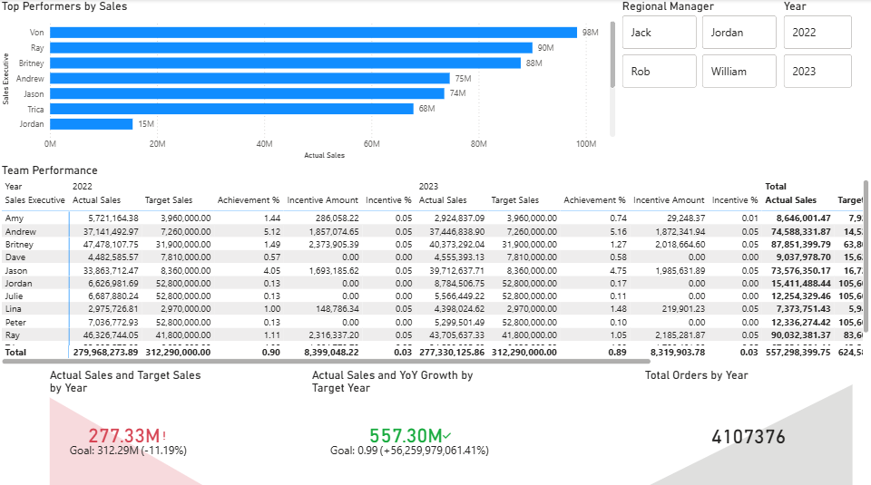
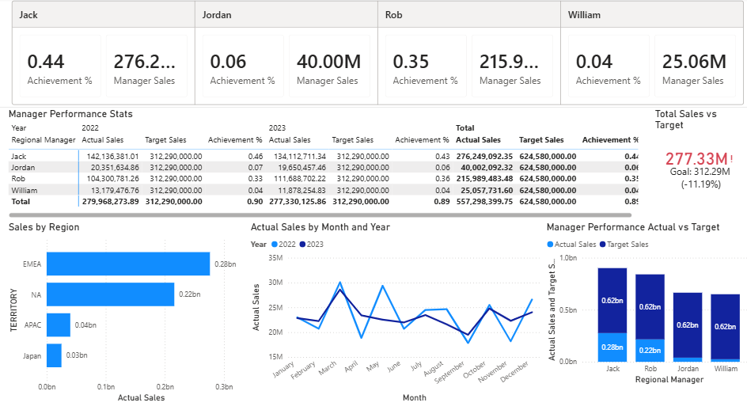
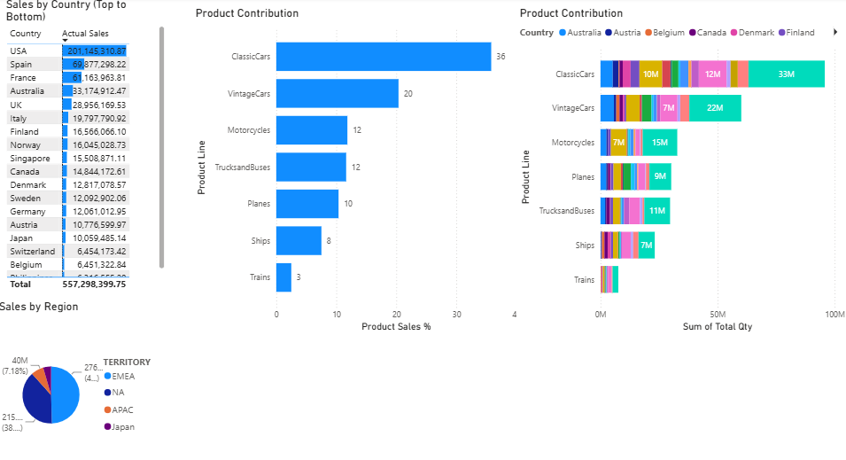
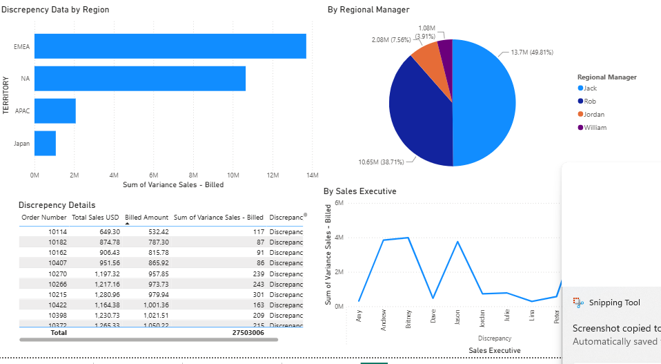

# 📊Global-Sales-Performance-Analytics-Reconciliation-Dashboard (PowerBI)

## Overview

This project demonstrates an end-to-end Power BI analytics solution that transforms raw multi-currency sales transactions into actionable business intelligence.

The solution covers data cleansing, financial reconciliation, sales performance monitoring, target tracking, incentive calculations, regional analysis, and product contribution analysis.

The dashboards were designed to help business stakeholders monitor sales performance, identify trends, evaluate target achievement, and investigate sales-versus-billing variances.

---

## Business Problem

Organizations operating across multiple regions often face challenges in:

- Consolidating sales data from different currencies
- Reconciling sales and billing records
- Tracking sales team performance against targets
- Calculating incentives consistently
- Understanding regional and product-level performance
- Identifying top-performing sales executives and managers

This dashboard provides a centralized reporting solution to address these challenges.

---

## Dataset

The project uses the following datasets:

- Sales_Data
- Bill Details
- Sales Team Target
- Reference Data

### Special Data Handling

Because Order Numbers were not unique across the dataset, a Composite Key was created using:

`Order Number + Order Date`

This key was used to ensure accurate reconciliation and relationship management between tables.
s
---

## Solution Highlights

### Data Preparation

- Cleaned inconsistent Order Date formats
- Standardized multi-currency transactions into USD
- Built Date Dimension and Year Dimension tables
- Created Sales Executive and Regional Manager hierarchy

### Performance Scorecard

- Actual Sales
- Target Sales
- Achievement %
- Incentive Calculation
- Sales Executive Performance Tracking
- Regional Manager Performance Aggregation

### Financial Reconciliation

- Compared Sales and Billing Amounts
- Calculated Variances
- Flagged Discrepancies
- Built transaction-level reconciliation analysis

### Business Intelligence Analysis

- Monthly Sales Trends
- Year-over-Year Comparison
- Regional Contribution Analysis
- Product Contribution Analysis
- Country-level Performance Analysis
- Top Performers Dashboard

---

## Data Model

### Fact Tables

- Sales_Data
- Bill Details

### Dimension Tables

- Date Table
- Dim Year
- Dim Sales Executive
- Sales Team Map

### Model Design

The solution follows a dimensional modeling approach to support scalable reporting and maintain accurate filter propagation throughout the model.

---

## Key DAX Measures

### Actual Sales

```DAX
Actual Sales =
SUM(Sales_Data[Total Sales (USD)])
```

### Target Sales

```DAX
Target Sales =
SUM('Sales Exec Target'[Target])
```

### Achievement %

```DAX
Achievement % =
DIVIDE([Actual Sales],[Target Sales])
```

### Incentive %

```DAX
Incentive % =
SWITCH(
    TRUE(),
    [Achievement %] >= 1, 0.05,
    [Achievement %] >= 0.8, 0.03,
    [Achievement %] >= 0.7, 0.01,
    0
)
```

### Incentive Amount

```DAX
Incentive Amount =
[Actual Sales] * [Incentive %]
```

---

## Dashboard Pages

### 1. Team Performance Dashboard

Features:

- Sales Executive Performance Matrix
- Target vs Actual Tracking
- Incentive Analysis
- Top Performer Ranking
- Year-wise Performance Comparison

---

### 2. Regional Manager Dashboard

Features:

- Manager Performance Overview
- Achievement Percentage
- Team Rollups
- Monthly Sales Trends
- Regional Sales Analysis

---

### 3. Product Geography Dashboard

Features:

- Country-Level Sales Performance
- Product Line Contribution
- Regional Revenue Distribution
- Product Category Analysis

---

### 4. Financial Reconciliation Dashboard

Features:

- Sales vs Billing Reconciliation
- Variance Identification
- Exception Analysis
- Transaction-Level Review

---

## Dashboard Screenshots

## Team Performance Dashboard


---

## Regional Manager Dashboard


---

## Product Geography Dashboard


---

## Reconcilation Dashboard



---


-# Tools Used

- Power BI Desktop
- Power Query
- DAX
- Microsoft Excel
- Data Modeling
- KPI Development

---

## Skills Demonstrated

- Data Modeling
- DAX Development
- Power Query Transformations
- Dashboard Design
- Business Intelligence
- Financial Reconciliation
- Sales Analytics
- KPI Reporting
- Performance Management

---

## Author

**Shiv Sagar**

Data Analyst | Power BI Developer

LinkedIn: www.linkedin.com/in/shiv-sagar7

---
``
